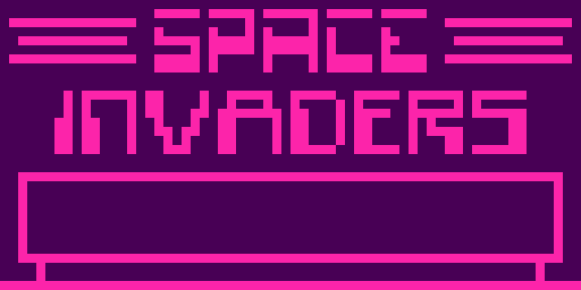

# XCHIP8

A Chip8 interpreter written in C#, .NET Core 2 and SDL2

## What's Implemented
- All Instructions except SYS nnn

## Things to do
1. Add a CLI/UI
2. Add options to tweak clock speed and Color Pallete
3. Make the emulator Cycle Accurate.
4. Super Chip8 instructions.

## Screenshots

### Trip8 Demo

### Space Invaders
